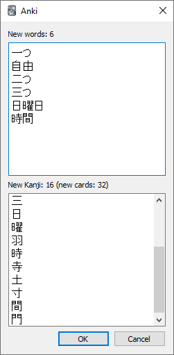

# Kanji Unlock Addon

This Anki add-on automatically unsuspends cards from a **kanji deck** according to what words have already been seen in a Japanese **vocabulary deck**, with the goal of matching progress between knowledge of vocabulary and knowledge of kanji.

This is only useful for people who prefer to simultaneously study vocabulary **and** kanji.

The order that kanji appear in a kanji deck typically differs from the order in which they are first seen in a vocabulary deck. As an example, you may see the word 日曜日 (Sunday) in the first 50 words of a vocabulary deck, but the middle kanji 曜 may be placed much farther in a kanji deck. Not fun having to learn 600 other kanji before getting to see what 曜 means!

Only useful kanji seen in actual words will be unsuspended and studied, easying up the workload.

## Use

Two menu items are added to the Tools menu.

Selecting **KanjiUnlockAddon: Unsuspend new kanji** will take the newly learned vocabulary cards and check what kanji they contain. Those kanji will be unsuspended in the kanji deck. The tag '**kanjiunsuspended**' will be added to those vocabulary cards.

## Setting up

### Suspend kanji cards

Since this add-on works by unsuspending kanji cards, they must be suspended for it to do anything. Cards can be suspended in the Anki card browser. Typically all kanji cards would be suspended before letting the add-on unsuspend the useful ones.

### Install script

To use the add-on, the *vocabtokanji* folder should be copied to the Anki add-on folder  
(Anki2/addons21/ accessible in Anki with *Tools > Add-ons > View Files*).

### Setting deck/field names

Before the add-on can work it needs to know which deck is the **Vocabulary deck** and which is the **Kanji deck**.  
These can be set with **Tools > KanjiUnlockAddon: Set vocabulary/kanji decks**.

The **Kanji field** should be set to the field that contains *just* the Kanji.

The **Word field** should contain just the Japanese word.

#### Components field

The kanji deck should ideally contain a field with the kanji's radicals, so that they are unlocked as well.  
As an example, the kanji deck that was tested has a field called *Components*.

The kanji note for 時 has in its *Components* field

&nbsp;&nbsp;&nbsp;&nbsp;&nbsp;&nbsp;日: day; sun; Japan; counter for days  
&nbsp;&nbsp;&nbsp;&nbsp;&nbsp;&nbsp;寺: Buddhist temple

And 寺 itself has in its *Components*:

&nbsp;&nbsp;&nbsp;&nbsp;&nbsp;&nbsp;土: soil; earth; ground; Turkey  
&nbsp;&nbsp;&nbsp;&nbsp;&nbsp;&nbsp;寸: measurement; foot/10

As such, if there is a proper field selected for **Kanji radicals/components field**, the vocabulary word 時 would unlock not only the kanji card 時 but also the cards for 日, 寺, 土, and 寸.

---

This add-on has been tested with Anki 2.1.33

